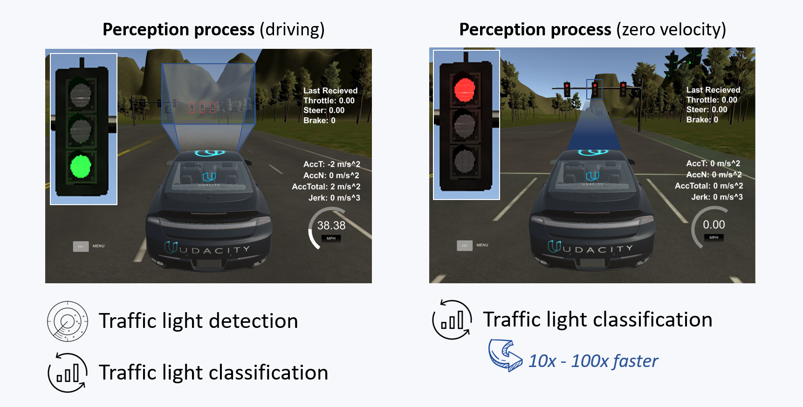

# CarND-Capstone Project
This is the project repo for the final project of the Udacity Self-Driving Car Nanodegree: Programming a Real Self-Driving Car. For more information about the project, see the project introduction [here](https://classroom.udacity.com/nanodegrees/nd013/parts/6047fe34-d93c-4f50-8336-b70ef10cb4b2/modules/e1a23b06-329a-4684-a717-ad476f0d8dff/lessons/462c933d-9f24-42d3-8bdc-a08a5fc866e4/concepts/5ab4b122-83e6-436d-850f-9f4d26627fd9).

The goal of this project is to implement core functionalities of a self-driving car:

- Traffic light detection
- Waypoint following
- Control

## Team TBD
| Team member | Main responsibility | Email |
|-------------|---------------------|------------------|
| Will        | Controller          |                  |
| Dominik Schniertshauer     | Perception  |     dominik.schniertshauer@googlemail.com |   
| Rudolf Dittrich | Waypoint updater| rudi.dittrich77@gmail.com  |
| Chris Guarino       | Testing             | cguarino@fienuxmotors.com        |


## System Architecture

The figure below shows the system architecture comprising the __Perception__, the __Planning__ and the __Control__ subsystem. The __Perception__ subsystem is responsible for traffic light detection. The __Planning__ subsystem provides a trajectory that the vehicle shall follow and the __Control__ subsystem generates steering, throttle and break commands based in the received trajectory. Each subsystem will be described in more detail in the following sections.

<figure>
<a href="url"></a>
<figcaption>Source: Udacity</figcaption>
</figure>

## Perception
### Overview
The perception component of our system in composed of two Deep Learning models:
- **Traffic light detection**
- **Traffic light classification**

The reason of having two seperate models instead of a single one is **performance**. The detection part is always working on the whole images, that it's receiving through a subscription to the image node. Those images introduce more variance, since many more different objects and surroundings than just traffic lights are present. So for detection two factors will make it necessary, to have a model with many parameters.
- the input of the model will be rather big
- the model needs to be able dealing with more variance in the data

The classification of traffic lights in turn is a rather easy job. The variance of images to process is limited and ther size is just a fraction of the original image.

By separating detection and classification into two models, we can do the following: if the car is standing at a stopline and already detected the position of a traffic light with a high enough confidence, there is no need to return the detection step. By only doing the classification on the already known traffic light position, ressources are saved and the inference for perception of a green light can be speeded up by a factor between 10 to 100. 

<figure>
<a href="url"></a>
<figcaption>Perception process overview</figcaption>
</figure>

### Traffic light detection
The traffic light detection is a **MobileNet Single Shot Detector (SSD)** architecture, provided and pretrained on the COCO dataset by Tensorflow. Even if its inference is still very time consuming in real-time situations, its performance is much better than compared to models like **Faster RCNN** by keeping an acceptable level of model performance. No fine-tuning was involved, since the detector performed sufficiently on our training set.
After detecting a set of traffic lights, the detection with highest confidence gets passed to the traffic light classifier.

### Traffic light classification
The traffic light classification model consists of the following building blocks: 
- **Convolution:** 16 filter, filter size = (3,3), ReLu
- **MaxPooling:** pooling size = (2,2)
- **Convolution:** 32 filter, filter size = (3,3), ReLu
- **MaxPooling:** pooling size = (2,2)
- **Dense:** 50 nodes, ReLu 
- **Dropout:** factor = 0.5
- **Dense:** 3 nodes, Softmax

The models accepts resized images of shape (32,32,3) as inputs. As training data we used the already annotated images of Anthony Sarkis, which were shared in an article of Vatsal Srivastava. (https://becominghuman.ai/traffic-light-detection-tensorflow-api-c75fdbadac62) Thank you very much for this. 

During training, various augmentation techniques like shifts, zooms, rotations or horizontal flips were used. We used *adam* as an optimizer to improve the *categorical crossentropy* of a validation dataset as much as possible. After 150 epochs, the best model was chosen based on its validation score and transformed to a frozen inference graph. 

## Planning
The _Planning_ _Subsystem_ is responsible for generating a trajectory through the world to get us to a final target. The _PLanning_ _Subsystem_ consists of two ROS nodes. The _Waypoint Loader_ and the _Waypoint Updater_ node.

### Waypoint Loader
The _Waypoint Loader_ loads all the waypoints of a certain track and broadcast these waypoints over the /base_waypoints topic to other listeners like the _Waypoint Uploader_ or the _Traffic Light Detection Node_. This component was already implemented by Udacity and was not modified.

### Waypoint Updater
The _Waypoint Updater_ (WU) updates the target velocity for the waypoints ahead of the car. It sets the target velocity for each waypoint based on upcoming traffic lights and their corresponding states. 

It receives all waypoints for a certain route from the _Waypoint Loader_ node, the current position either from the Simulator or from Carla and traffic waypoint messages from the _Traffic Light Detection_ node. Based on this information the WU takes the closest 200 waypoints ahead and publishes them to /final_waypoint. 

If a RED traffic light is within these waypoints then it reduces the velocity in these waypoints so that it stops more or less at the traffic light stop line. When the traffic light turns GREEN again it increases velocity in the upcoming waypoints with constant acceleration.

## Control

### DBW Node

This module, last layer of the process, is responsable to publish throttle, brake and steer commands to control the vehicle. Different methods were used for each of these commands:

#### Throttle
First, the difference between the actual velocity and the desired velocity is calculated. The obtained value is compared wth the acceleration limits provided by external parameters, taking in count a time differential between the last meassure and the actual one. Later, a PID is fed using the final value. Before setting the throttle value to the one return by the PID, a low pass filter is used to avoid interference by noise. 

#### Brake
If the throttle value calculated before is 0, brake calculatio is activated. Using the value return by the velocity PID a new brake value is set taking in count the mass of the vehicle, the mass of the fuel and the wheel radious. Note that the PID parameters Kp, Kd and Ki were tune by trial and error.

#### Steering
In order to control steer two elements were used. First, an instance of the yaw controller is created being the principal element to calculate the next steering value based on the actual velocity, the desired velocity and the actual angular velocity. As a second element, a low pass filter was integrated to increase estability.  

### Run code

```bash
cd ~/CarND-Capstone/ros
source devel/setup.bash
roslaunch launch/styx.launch
```


### Native Installation

* Be sure that your workstation is running Ubuntu 16.04 Xenial Xerus or Ubuntu 14.04 Trusty Tahir. [Ubuntu downloads can be found here](https://www.ubuntu.com/download/desktop).
* If using a Virtual Machine to install Ubuntu, use the following configuration as minimum:
  * 2 CPU
  * 2 GB system memory
  * 25 GB of free hard drive space

  The Udacity provided virtual machine has ROS and Dataspeed DBW already installed, so you can skip the next two steps if you are using this.

* Follow these instructions to install ROS
  * [ROS Kinetic](http://wiki.ros.org/kinetic/Installation/Ubuntu) if you have Ubuntu 16.04.
  * [ROS Indigo](http://wiki.ros.org/indigo/Installation/Ubuntu) if you have Ubuntu 14.04.
* [Dataspeed DBW](https://bitbucket.org/DataspeedInc/dbw_mkz_ros)
  * Use this option to install the SDK on a workstation that already has ROS installed: [One Line SDK Install (binary)](https://bitbucket.org/DataspeedInc/dbw_mkz_ros/src/81e63fcc335d7b64139d7482017d6a97b405e250/ROS_SETUP.md?fileviewer=file-view-default)
* Download the [Udacity Simulator](https://github.com/udacity/CarND-Capstone/releases/tag/v1.2).

### Docker Installation
[Install Docker](https://docs.docker.com/engine/installation/)

Build the docker container
```bash
docker build . -t capstone
```

Run the docker file
```bash
docker run -p 4567:4567 -v $PWD:/capstone -v /tmp/log:/root/.ros/ --rm -it capstone
```

### Usage

1. Clone the project repository
```bash
git clone https://github.com/udacity/CarND-Capstone.git
```

2. Install python dependencies
```bash
cd CarND-Capstone
pip install -r requirements.txt
```
3. Make and run styx
```bash
cd ros
catkin_make
source devel/setup.sh
roslaunch launch/styx.launch
```
4. Run the simulator

### Real world testing
1. Download [training bag](https://drive.google.com/file/d/0B2_h37bMVw3iYkdJTlRSUlJIamM/view?usp=sharing) that was recorded on the Udacity self-driving car (a bag demonstraing the correct predictions in autonomous mode can be found [here](https://drive.google.com/open?id=0B2_h37bMVw3iT0ZEdlF4N01QbHc))
2. Unzip the file
```bash
unzip traffic_light_bag_files.zip
```
3. Play the bag file
```bash
rosbag play -l traffic_light_bag_files/loop_with_traffic_light.bag
```
4. Launch your project in site mode
```bash
cd CarND-Capstone/ros
roslaunch launch/site.launch
```
5. Confirm that traffic light detection works on real life images
